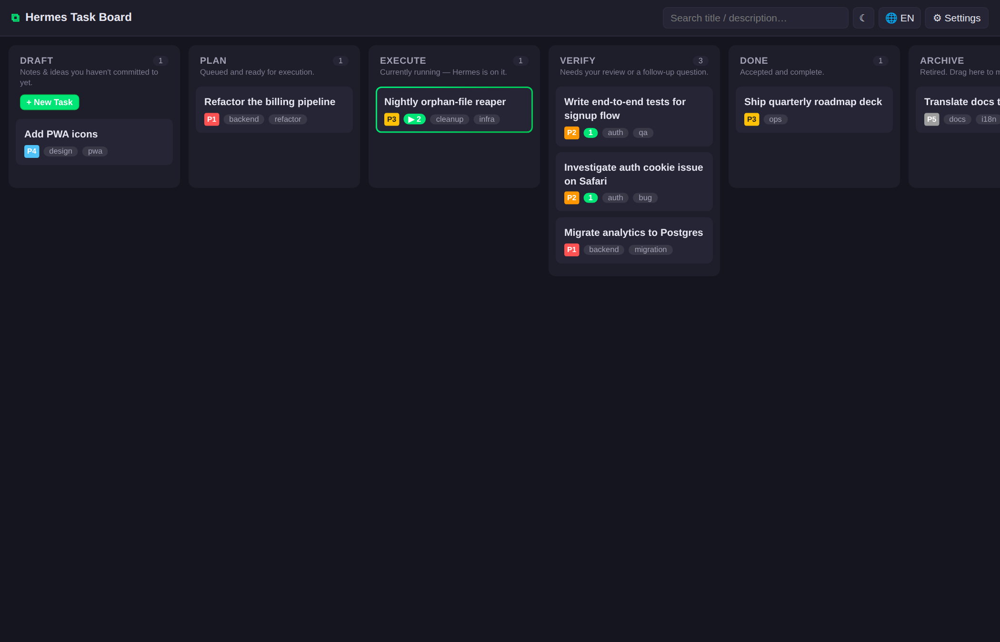
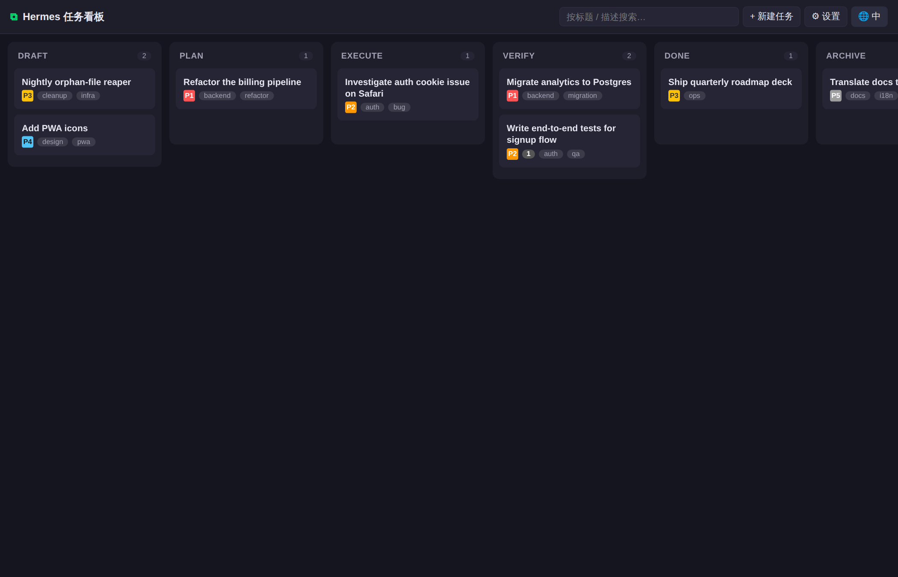
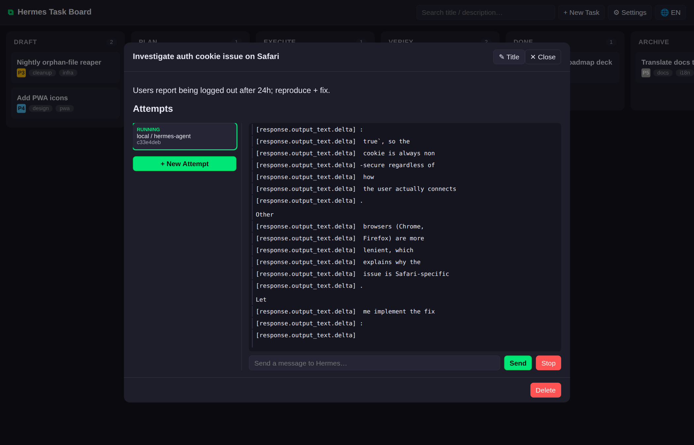
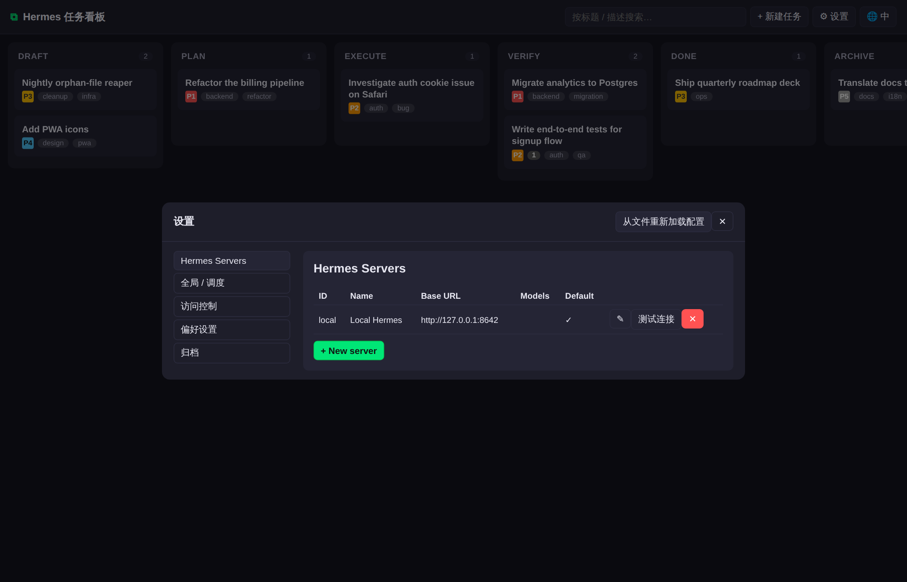
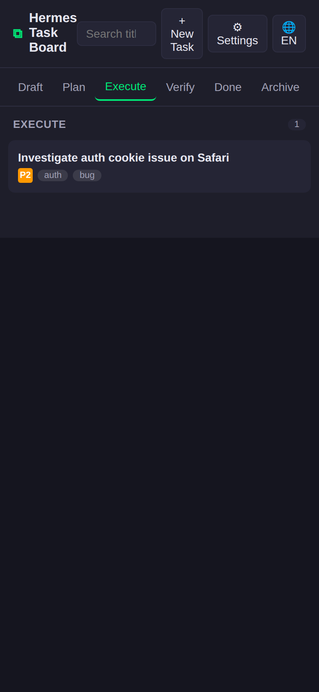
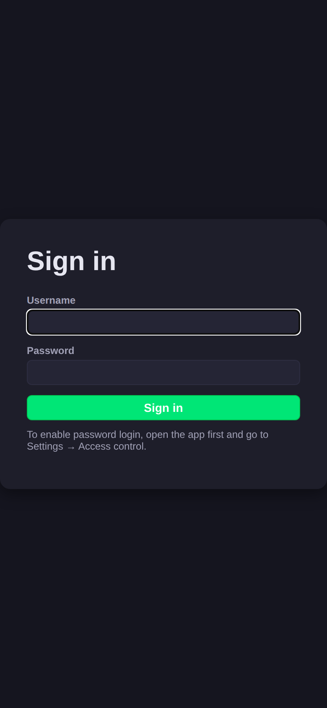

# Hermes Task Board

> A Trello-style kanban that drives [Hermes Agent](https://github.com/NousResearch/hermes-agent) in batches — define tasks, dispatch them sequentially or in parallel, watch the agent work, verify, archive.
>
> Single Go binary · SQLite + filesystem · Vue 3 (no build step) · PWA · bilingual UI.

[English](#english) · [简体中文](#简体中文)



---

## English

### Why this exists

[Hermes](https://github.com/NousResearch/hermes-agent) is one of the more interesting agents out there. Unlike OpenClaw and most other agent frameworks, Hermes **learns from use** — every session adds to its memory, skills, and context, so it compounds: the agent you're working with six months in is measurably sharper than the one you started with. It isn't a stateless tool that vanishes after each reply; it's a digital collaborator that grows alongside you.

Hermes also plugs into a remarkable range of messaging platforms — Telegram, Discord, Slack, WhatsApp, WeChat, Feishu (Lark), DingTalk, QQ, and more — and steering it from a chat client is genuinely enjoyable. The snag is that chat-driven workflows have a hard ceiling:

- A conversation is strictly serial. You can only drive one task at a time.
- Switching sessions or agent profiles mid-flight is awkward: you lose your train of thought, and running things in parallel is basically off the table.

Once you actually have a **backlog** — a batch of refactors, an audit pass, a nightly sweep, a stack of small scripted jobs — the chat-first model starts to fight you. What you want is to queue everything up front, declare priorities and dependencies, then step away and let Hermes chew through it in order or in parallel while you do something else.

That's what this project is for. **Hermes Task Board turns Hermes from a chatbot you tend one conversation at a time into a batch-capable work partner.** Plan once, dispatch automatically, watch the tool calls stream live, verify, move on. The goal is simple: get dramatically more out of every hour Hermes is running.

### What it does

Hermes Agent executes tools, edits files, and runs shell commands. This project gives you a 6-column kanban so you can:

1. **Define** tasks — markdown description, tags, priority, dependencies, preferred Hermes server + model.
2. **Dispatch** each task to a Hermes conversation as one or more parallel **Attempts** (auto-triggered by the scheduler, or manually via *Start*).
3. **Watch** Hermes think and tool-call in real time — NDJSON event log on disk, pushed to the browser over SSE.
4. **Verify** the result, ask follow-up questions in the same session, then move the card to Done or Archive.

### Screenshots

| | |
|---|---|
|  |  |
| Desktop board, English | The same board after toggling to Chinese |
|  |  |
| Live SSE stream from a running Hermes attempt | Hermes Servers settings page |
|  |  |
| Phone layout: one column at a time, status tabs on top | Optional password login page |

### Quick start (download a release)

```bash
# 1. Grab the binary for your platform from the GitHub releases page:
#    https://github.com/ahkimkoo/hermes-taskboard/releases
curl -LO https://github.com/ahkimkoo/hermes-taskboard/releases/latest/download/hermes-taskboard-v0.1.0-linux-amd64.tar.gz
tar -xzf hermes-taskboard-v0.1.0-linux-amd64.tar.gz
cd hermes-taskboard-v0.1.0-linux-amd64

# 2. (Re)start your Hermes gateway with the HTTP API enabled.
API_SERVER_ENABLED=true API_SERVER_KEY=your-strong-key hermes gateway run

# 3. Start the board.
./hermes-taskboard -data ./data
# then open http://127.0.0.1:1900 in your browser
```

On first visit, click **⚙ Settings → Hermes Servers → New server**, point `base_url` at `http://127.0.0.1:8642` and paste the same `API_SERVER_KEY`. Hit **Test Connection** — green means you're good. Back on the board, create a task and click **▶ Start**.

### Set up Hermes for this board

The Hermes gateway ships an OpenAI-compatible HTTP API on port **8642**. Enable it one of three ways:

- **Environment variables** (quick and dirty):
  ```bash
  API_SERVER_ENABLED=true \
  API_SERVER_KEY=choose-a-strong-key \
  API_SERVER_PORT=8642 \
  API_SERVER_HOST=127.0.0.1 \
    hermes gateway run
  ```
- **`~/.hermes/.env`** (persistent): put the same four lines there.
- **`~/.hermes/config.yaml` → `platforms.api_server`** (see Hermes docs for the exact schema).

Sanity check:

```bash
curl -H "Authorization: Bearer your-strong-key" http://127.0.0.1:8642/health/detailed
curl -H "Authorization: Bearer your-strong-key" http://127.0.0.1:8642/v1/models
```

If you want other machines on your LAN to reach the API, set `API_SERVER_HOST=0.0.0.0` **and** use a key of at least 8 characters — Hermes refuses to bind network interfaces without one.

### Build from source

```bash
git clone git@github.com:ahkimkoo/hermes-taskboard.git
cd hermes-taskboard
./build.sh                           # current host platform
GOOS=linux GOARCH=arm64 ./build.sh   # cross-compile
VERSION=v0.1.0 ./release.sh          # cross-platform archives under dist/
```

`release.sh` produces `linux/amd64`, `linux/arm64`, `darwin/amd64`, `darwin/arm64`, and `windows/amd64` archives by default. Each archive ships the binary, `config.example.yaml`, an empty `data/` skeleton (`db/`, `task/`, `attempt/`), and a copy of `README.md`, `CHANGELOG.md`, and `LICENSE`.

### Docker

```bash
# Build
docker build -t hermes-taskboard:dev .

# Run (persist state to a host folder)
docker run -d --name taskboard \
  -p 1900:1900 \
  -v "$PWD/tb-data:/data" \
  --add-host=host.docker.internal:host-gateway \
  hermes-taskboard:dev
```

In the app's **Settings → Hermes Servers**, set `base_url` to `http://host.docker.internal:8642` (Hermes runs on the host, not inside the container).

### Architecture

```
Browser (Vue 3)              Hermes Task Board (Go)            Hermes Gateway
-----------------            ---------------------------       ------------------
Kanban view      ────SSE───► HTTP + SSE hub
Execute modal    ────HTTP──► Board service (state machine)
                             │
                             ▼
                             Scheduler  ─┐
                             AttemptRunner ───HTTP + SSE────► /v1/responses
                             │                                /v1/runs/{id}/events
                             ▼
                             SQLite + data/{task,attempt}/    model: hermes-agent
```

- **State machine:** `draft → plan → execute → verify → done → archive`. Only `plan → execute`, `execute → verify`, and `verify → execute` are auto-transitions; everything else happens via drag.
- **One Attempt = one Hermes conversation.** Follow-ups during verification stay in the same conversation — they just spawn a new `run_id`.
- **Concurrency** is gated at three levels: global, per-server, and per `(server, model)` profile. Defaults are 50 / 10 / 5.

### Config hot-reload

Everything configurable — credentials, registered Hermes servers, scheduler knobs, preferences — lives in `data/config.yaml`. Edit it by hand, then either click **Reload config from file** in the Settings page or `POST /api/config/reload`. No restart required.

### Development

```bash
go build ./...               # type-check
go build -o bin/tb ./cmd/taskboard
./bin/tb -data ./data        # dev run; the frontend is embedded via go:embed
```

Frontend sources live at `internal/webfs/web/` and are served straight out of the binary. Editing `.js`, `.css`, or `.html` in that directory requires a Go rebuild — there's no Vite or Rollup in the loop.

### Testing

- `go build ./...` — static checks.
- `./docs/smoke.sh` — API smoke test (create → transition → delete).
- Browser check — open the UI, create a task, click Start, watch events stream. The screenshots under `docs/screenshots/` were captured with Playwright against a real Hermes instance running on the same host.

### License

MIT.

---

## 简体中文

### 项目初衷

[Hermes](https://github.com/NousResearch/hermes-agent) 是目前最有意思的 Agent 之一。不同于 OpenClaw 这类"无状态工具"，Hermes 会**在使用中成长** —— 每一次对话都会沉淀到它的记忆、技能和上下文里，用得越久越聪明。它不是一个用完即走的工具，更像一位**和你一起成长的数字伙伴**，越用越合手。

Hermes 还能对接几乎所有主流的即时通讯平台 —— Telegram、Discord、Slack、WhatsApp、微信、飞书、钉钉、QQ 等等 —— 在聊天窗口里随手遥控 Hermes 干活，体验相当不错。但聊天驱动的工作流也存在一个天然的瓶颈：

- 一段对话是严格串行的，一次只能推进一件事。
- 中途想切换 session、切换 agent profile 都有些别扭，思路容易被打断，更谈不上并行执行。

当你手头真的攒了一堆事情想交给 Hermes —— 一批重构、一次代码审计、一个夜间数据清理、一堆零散的小脚本 —— 这种聊天式的用法反而成了效率天花板。你需要的是把待办一次性列清楚，标好优先级和依赖关系，然后让 Hermes 按顺序或者并行地去啃，自己则可以腾出手来做别的事。

本项目就是为此而生。**Hermes Task Board 把 Hermes 从"一次一件"的聊天助手，升级成能吃批量活的工作搭档**：从任务清单里按优先级自动派发、工具调用实时可见、逐个验收。目标只有一个 —— 让 Hermes 的每一小时运行时间都发挥出成倍的价值。

### 这是什么

Hermes Agent 本身负责调用工具、编辑文件、执行 shell 命令。本项目给它加了一个 6 列看板，让你可以：

1. **定义**任务 —— markdown 描述、标签、优先级、依赖、指定使用哪一个 Hermes Server 和 model。
2. **分派**到 Hermes —— 每张卡可以并行开多个 **Attempt**（调度器自动触发，或手动点"开始"）。
3. **实时观察** Hermes 的思考流与工具调用 —— 落盘为 NDJSON 事件日志，通过 SSE 推送到浏览器。
4. **验证**结果，在同一个 Session 里继续追问，确认后把卡片拖到"完成"或"归档"。

### 截图

| | |
|---|---|
|  |  |
| 桌面端 6 列看板 · 英文界面 | 同一界面切换到中文后的样子 |
|  |  |
| 真实 Hermes 调用中的 SSE 事件流 | Hermes Servers 管理页 |
|  |  |
| 手机端一次展示一列，顶部状态 tab 切换 | 可选开启的账号密码登录页 |

### 普通用户快速上手（下载 release 包运行）

```bash
# 1. 从 GitHub Releases 下载对应平台的压缩包：
#    https://github.com/ahkimkoo/hermes-taskboard/releases
curl -LO https://github.com/ahkimkoo/hermes-taskboard/releases/latest/download/hermes-taskboard-v0.1.0-linux-amd64.tar.gz
tar -xzf hermes-taskboard-v0.1.0-linux-amd64.tar.gz
cd hermes-taskboard-v0.1.0-linux-amd64

# 2. 带上 API_SERVER_KEY 启动 Hermes gateway
API_SERVER_ENABLED=true API_SERVER_KEY=你的强密钥 hermes gateway run

# 3. 启动看板
./hermes-taskboard -data ./data
# 然后在浏览器里打开 http://127.0.0.1:1900
```

首次打开页面后，点 **⚙ 设置 → Hermes Servers → 新增 server**，把 `base_url` 填成 `http://127.0.0.1:8642`，`api_key` 填刚才那个强密钥，点 **测试连接**，绿了就 OK。回到看板，新建一张任务，点 **▶ 开始** 即可。

### Hermes 侧配置

Hermes 自带的 gateway 提供了一个 OpenAI 兼容的 HTTP API，默认端口 **8642**。开启方式三选一：

- **环境变量（临时使用）**：
  ```bash
  API_SERVER_ENABLED=true \
  API_SERVER_KEY=一个至少 8 位的强密钥 \
  API_SERVER_PORT=8642 \
  API_SERVER_HOST=127.0.0.1 \
    hermes gateway run
  ```
- **`~/.hermes/.env`（持久化）**：把上面四行写进去即可。
- **`~/.hermes/config.yaml` 的 `platforms.api_server` 段**：具体字段见 Hermes 官方文档。

验证：

```bash
curl -H "Authorization: Bearer 你的强密钥" http://127.0.0.1:8642/health/detailed
curl -H "Authorization: Bearer 你的强密钥" http://127.0.0.1:8642/v1/models
```

如果需要局域网里其他机器也能访问，把 host 改成 `0.0.0.0`，并且 `API_SERVER_KEY` 至少 8 位 —— Hermes 会拒绝"空密钥 + 公网绑定"这种危险组合。

### 从源码构建

```bash
git clone git@github.com:ahkimkoo/hermes-taskboard.git
cd hermes-taskboard
./build.sh                           # 当前平台
GOOS=linux GOARCH=arm64 ./build.sh   # 交叉编译
VERSION=v0.1.0 ./release.sh          # 一次性打齐所有平台到 dist/
```

`release.sh` 默认产出 linux/amd64、linux/arm64、darwin/amd64、darwin/arm64、windows/amd64 五种压缩包，每个包里都包含可执行文件、`config.example.yaml`、空的 `data/` 骨架目录（`db/`、`task/`、`attempt/`），以及 `README.md`、`CHANGELOG.md`、`LICENSE`。

### Docker 部署

```bash
# 构建镜像
docker build -t hermes-taskboard:dev .

# 运行（把数据挂到宿主机目录）
docker run -d --name taskboard \
  -p 1900:1900 \
  -v "$PWD/tb-data:/data" \
  --add-host=host.docker.internal:host-gateway \
  hermes-taskboard:dev
```

然后在设置里把 Hermes Server 的 `base_url` 填成 `http://host.docker.internal:8642` —— 因为 Hermes 跑在宿主机上，不在容器里。

### 架构概览

```
浏览器 (Vue 3)               Hermes Task Board (Go)            Hermes Gateway
-----------------            ---------------------------       ------------------
看板视图         ────SSE───► HTTP + SSE hub
执行面板         ────HTTP──► Board 状态机
                             │
                             ▼
                             调度器  ─┐
                             AttemptRunner ────HTTP + SSE────► /v1/responses
                             │                                 /v1/runs/{id}/events
                             ▼
                             SQLite + data/{task,attempt}/     model: hermes-agent
```

- **状态机**：`draft → plan → execute → verify → done → archive`。只有 `plan → execute`、`execute → verify`、`verify → execute` 是后端自动迁移，其余全部由用户拖拽触发。
- **1 Attempt = 1 Hermes conversation**：验证阶段追问并不新开 Attempt，只是在同一 conversation 下起一个新的 `run_id`。
- **三级并发闸门**：全局 / 单个 Server / `(server, model)` 三层上限，默认 50 / 10 / 5。

### 配置热加载

所有可配置项 —— 账号密码、已注册的 Hermes Servers、调度参数、偏好设置 —— 全都写在 `data/config.yaml` 里。可以直接 `vim` 改，改完在设置页点 **从文件重新加载配置**（或 `POST /api/config/reload`）即可生效，不用重启进程。

### 开发

```bash
go build ./...
go build -o bin/tb ./cmd/taskboard
./bin/tb -data ./data    # 前端通过 go:embed 打包进二进制，不用单独构建
```

前端源文件放在 `internal/webfs/web/`，没有 Vite / webpack 之类的构建链路，改完 `.js`/`.css`/`.html` 需要重编 Go 二进制。

### 测试

- `go build ./...`：类型与静态检查
- `./docs/smoke.sh`：API 冒烟测试（创建 → 迁移 → 删除 一个循环）
- 浏览器冒烟：打开 UI → 新建任务 → 点开始 → 观察 SSE 事件流。`docs/screenshots/` 下的截图都是用 Playwright 对真实 Hermes 实例跑出来的。

### License

MIT.
